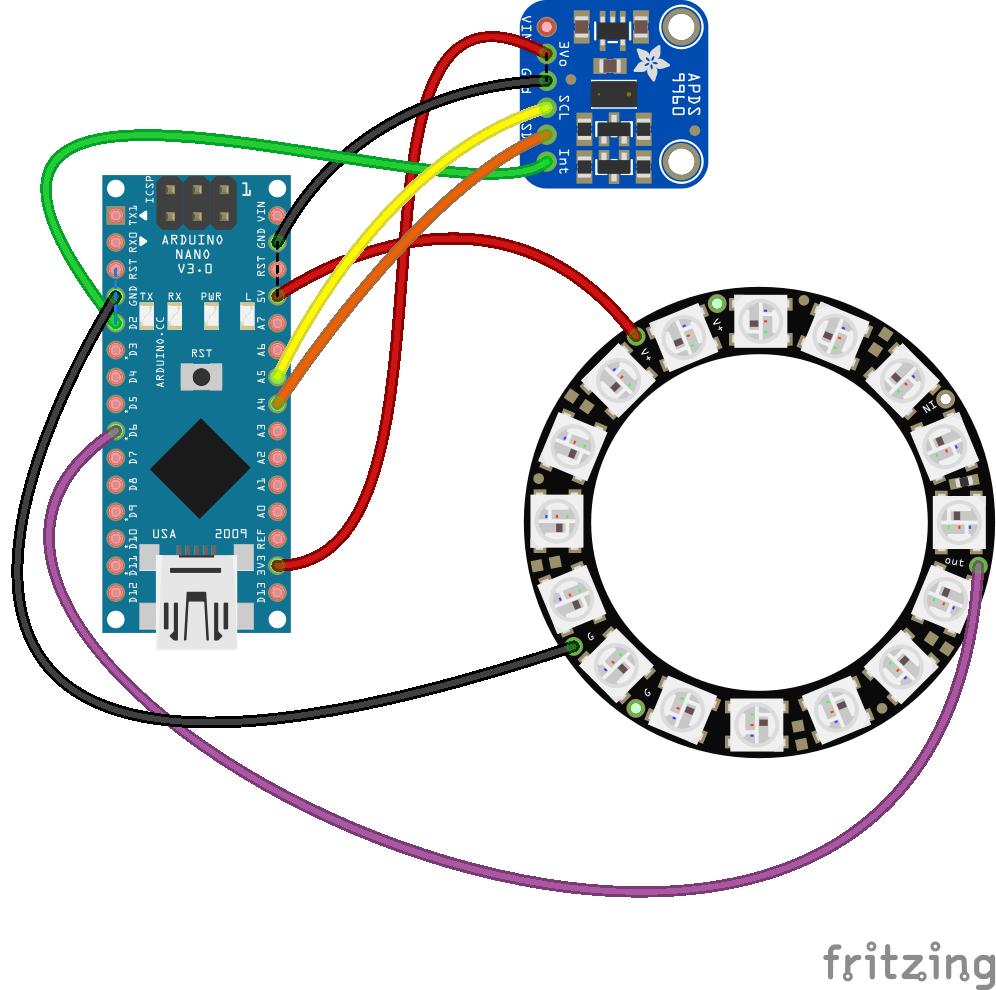

# Brushinator 5000

>Benjamin Harder
>6/2/2023

This code controls a SparkFun APDS-9960 proximity sensor and an Adafruit NeoPixel ring. It uses the proximity sensor to detect proximity levels and trigger an interrupt when the proximity level is too high or too low. When an interrupt is triggered, it reads the proximity level and turns on all the pixels in the NeoPixel ring to blue. Then, it turns off one pixel at a time in a clockwise direction until all the pixels are off. After that, the NeoPixel ring flashes green five times before turning off all the pixels.

The code includes two custom functions: `colorWipe()` and `interruptRoutine()`. The `colorWipe()` function fills the pixels with a specified color. The `interruptRoutine()` function updates a flag when an interrupt occurs.

### Libraries and Dependencies - SBOM

This code requires the `Adafruit NeoPixel` library,`Wire` library, and `SparkFun APDS-9960` library. Make sure to install these libraries in your Arduino IDE.

### Harderware Requirements - BOM
[Ardunino Nano](https://store-usa.arduino.cc/products/arduino-nano?selectedStore=us)

[SparkFun APDS-9960 Proximity Sensor](https://www.sparkfun.com/products/12787)

[Adafruit 16 NeoPixel Ring](https://www.adafruit.com/product/1463)

[Voltaic 5v always on battery](https://voltaicsystems.com/v25/)

### Hardware Connections

Here's the provided information converted into a Markdown table:

| Description                                              | Connection                         |
|----------------------------------------------------------|------------------------------------|
| interrupt pin of the APDS-9960                        | Digital pin 2|
| 3v3 pin of the APDS-9960                               | 3v3 pin              |
| GND pin of the APDS-9960                                | GND pin              |
| SDA pin of the APDS-9960                                | Analog pin 4 |
| SCL pin of the APDS-9960                                | Analog pin 5         |
| Data pin of the NeoPixel ring                           | Digital pin 6        |
| Ground pin of the NeoPixel ring                         | GND pin              |
| Power pin of the NeoPixel ring                          | 5v pin               |

#### Proximity Thresholds

The code uses a high proximity threshold of 300 and a low proximity threshold of 0.

#### NeoPixel Configurations

The NeoPixel ring is configured with 16 pixels. The brightness is set to a moderate level.

### Code Operation

1. The code initializes the sensor and configures the interrupt.
2. It starts running the proximity sensor with interrupts. If the sensor detects a proximity level above or below the thresholds, it triggers an interrupt.
3. The interrupt service routine updates a flag when an interrupt occurs.
4. In the main loop, when the flag indicates an interrupt has occurred, it reads the proximity level.
5. It then turns on all the pixels on the NeoPixel ring to blue, turns them off one by one in a clockwise direction, and finally flashes them green five times.
6. After the LEDs have flashed five times, the NeoPixel ring is turned off.
7. The flag is then reset, and the interrupt is cleared.
8. The code goes back to waiting for the next interrupt.

### Notes

This code demonstrates an effective use of the APDS-9960 proximity sensor and the Adafruit NeoPixel ring. It can be used as a starting point for a range of projects that need to use a proximity sensor to control a display, or for projects that require a user to interact with a system without making physical contact.
